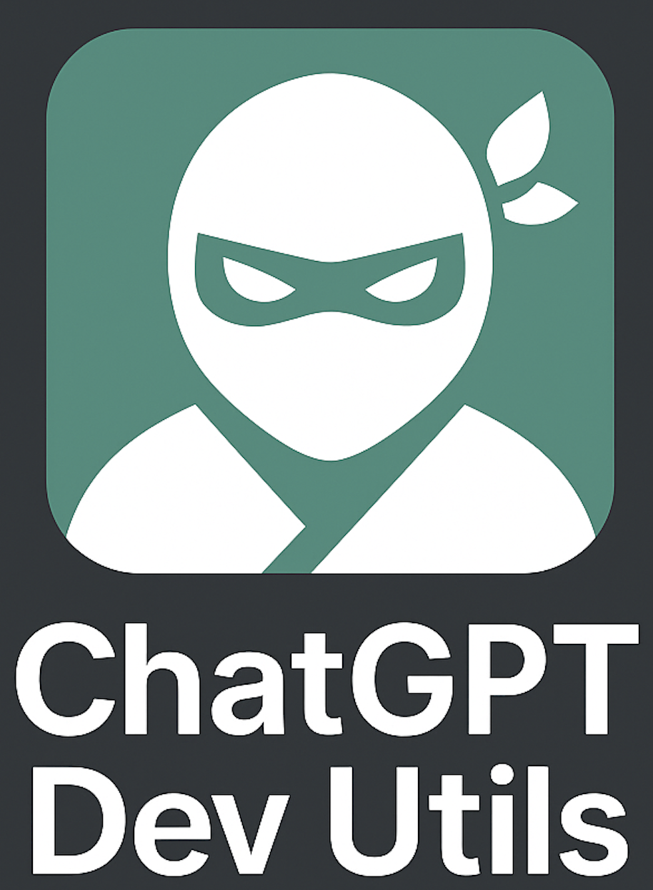

# ChatGPT Dev Utils

<p align="center">
  
</p>

A developer-friendly CLI tool that lets you send prompts to ChatGPT directly from your terminal, using your existing ChatGPT web session via a Chrome extension. Useful for generating commit messages, code explanations, translations, and more.

## ✨ Features

- Send prompts from CLI → Chrome extension → ChatGPT tab
- Preset prompt system (e.g., `explain`, `translate`, `commit-msg`)
- Interactive and non-interactive CLI modes
- Works via WebSocket and HTTP proxy server
- Avoids using OpenAI API (cost-effective)

## 📦 Installation

```bash
pnpm install
pnpm build
pnpm link  # or use node dist/chatgpt-dev-utils.js directly
```

## 🧪 Usage

### Interactive mode:
```bash
cgpt
```

### Non-interactive mode:
```bash
cgpt --nonInteractive --preset=explain ./src/index.ts
```

## 🧩 Presets

You can add custom prompt presets in `src/presets/`. Each preset exports a function like:

```ts
export async function generateExplainPrompt(input: string): Promise<string> {
  return `Explain this code:\n${input}`;
}
```

---

## 🧠 How It Works

1. CLI starts a small local server (`extension-proxy/server.ts`)
2. Chrome extension connects to it via WebSocket
3. CLI sends prompt to extension
4. Extension injects the prompt into ChatGPT tab
5. You get a response, visible in browser

---

## 🛠 Development

```bash
pnpm --filter cli dev
```

---

## 🧩 Extension Setup

1. Load `packages/extension` into Chrome as an unpacked extension
2. Ensure `chatgpt.com` is open
3. Allow extension permissions

---

## 🤝 License

This project is licensed under the [Apache 2.0 License](https://www.apache.org/licenses/LICENSE-2.0).
Copyright © 2025 Teruo Kunihiro.
